[](https://classroom.github.com/online_ide?assignment_repo_id=6951594&assignment_repo_type=AssignmentRepo)
# Algoritmos y Estructura de Datos
## Proyecto sobre Grafos
--------

## Integrantes

- Ricardo Carbajal Mezarina
- Diego Galvan Rodríguez
- Frings Douglas Barrueta Aspajo

El proyecto del curso consiste en implementar una estructura de datos de grafo y un file parser. La estructura debe soportar los métodos y algoritmos descritos a continuacion:  


## Graph data structure

* El grafo debe ser dinámico (inserciones. eliminaciones, búsquedas, ...)
* Se debe implementar los dos tipos de grafos: dirigidos y no-dirigidos.
* No considerar loops ni multi-arista.


### Methods:
```cpp
bool insertVertex(string id, TV data); // Creates a new vertex in the graph with some data and an ID
```

* Descripcion: Funcion elemental que permite insertar un vertice con un identificador y la data que guarda, esta funcion revisa si es que el id es repetido o no

* Parameters:
  - string id: Identificador del vertice, este es unico
  - TV data: Contenido del vertice, el tipo del dato se define cuando se crea el grafo

* Return:
  - bool: Retorna un true si se pudo insertar correctamente el vertice y un false si no

* Consideraciones: Ninguna


```cpp
bool createEdge(string start, string end, TE data); // Creates a new edge in the graph with some data
```

* Descripcion: Funcion elemental que permite insertar una arista con un peso especifico entre dos vertices que pueden ser identificados atraves de su id.

* Parameters:
  - string start: Identificador del vertice inicial
  - string end: Identificador del vertice final
  - TE data: Peso de la arista, el tipo del peso se define cuando se crea el grafo

* Return:
  - bool: Retorna un true si se pudo insertar la arista correctamente y un false si no

* Consideraciones: Para grafos no dirigidos, no importa el orden de los vertices ingresados, mientras que en grafos dirigidos la arista iniciara en el vertice con id start y apuntara el vertice con id end.

```cpp
bool deleteVertex(string id); // Deletes a vertex in the graph
```

* Descripcion: Funcion elemental que permite eliminar un vertice con el identificador de este, esta funcion elimina todas las aristas que este vertice tiene en su lista.

* Parameters:
  - string id: Identificador del vertice

* Return:
  - bool: Retorna true si se pudo eliminar correctamente el vertice y un false si no

* Consideraciones: Para grafos no dirigidos, tambien se eliminaran aristas en las listas de otras vertices, mientras que en grafos dirigidos solo se eliminaran las aristas que salgan del vertice a eliminar y que solo se encuentran en su lista de aristas.

```cpp
bool deleteEdge(string start, string end); // Deletes an edge in the graph, it is not possible to search by the edge value, since it can be repeated
```

* Descripcion: Funcion elemental que permite eliminar una arista entre dos vertices directamente conectados y que pueden indentificarse con los ids que se van a ingresar

* Parameters:
  - string start: Identificador del vertice inicial
  - string end: Identificador del vertice final

* Return:
  - bool: Retorna rue si se pudo eliminar correctamente la arista y un false si no

* Consideraciones: Para grafos no dirigidos, no importa el orden en que se ingresen los ids de los vertices, pues se va a eliminar la misma arista en ambas lista de aristas en los dos vertices. Para grafos dirgidos, solo se buscara la arista en la lista de aristas del vertice con id start y se eliminara la arista que apunta al vertice con id end.

```cpp
TE &operator()(string start, string end); // Gets the value of the edge from the start and end vertexes
```

* Descripcion: Funcion que retorna el peso de la arista entre dos vertices que se pueden identificar con sus ids.

* Parameters:
  - string start: Identificador del vertice inicial.
  - string end: Identificador del vertice final

* Return:
  - bool: Retorna el peso de la arista

* Consideraciones: Para grafos no dirigidos, no importa el orden de los ids ingresados

```cpp
float density() const; // Calculates the density of the graph
```

* Descripcion: Funcion que calcula la densidad del grafo en tipo float para que acepte decimales

* Parameters:
  - Ninguna

* Return:
  - float: Densidad del grafo

* Consideraciones: La formula usada para calcular la densidad cambio segun el tipo de grafo

```cpp
bool isDense(float threshold = 0.5) const; // Calculates the density of the graph, and determine if it is dense dependening on a threshold value
```

* Descripcion: Funcion que permite saber si un grafo es denso o no con un criterio variable

* Parameters:
  - float threshold: Es un valor predefinido con el que se va a comparar la densidad del grafo para ver si este es denso o no. 

* Return:
  - bool: Return un true si el grafo es denso y un false si no lo es

* Consideraciones: Ninguna

```cpp
bool isConnected(); // Detect if the graph is connected
```

* Descripcion: Funcion para grafos no dirigidos que determina si para cada vertice dentro del grafo se puede llegar a cualquier otro

* Parameters:
  - Ninguna

* Return:
  - bool: Retorna un true si el grafo esta conectado y un false si no

* Consideraciones: Solo aplica para grafos no dirigidos

```cpp
bool isStronglyConnected() throw(); // Detect if the graph is strongly connected (only for directed graphs)
```

* Descripcion: Funcion para grafos dirigidos que de manera similar a la funcion anterior verifica si en el grafo desde cualquier vertice se puede alcanzar a cualquier otro vertice

* Parameters:
  - Ninguna

* Return:
  - bool: Retornaun true si el grafo esta fuertemente conectado y un false si no

* Consideraciones: Solo aplica para grafos dirigidos

```cpp
bool empty(); // If the graph is empty
```

* Descripcion: Determina si el grafo esta vacio

* Parameters:
  - Ninguna

* Return:
  - bool: Retorna un true si el grafo esta vacio y un false si no

* Consideraciones: Ninguna

```cpp
void clear(); // Clears the graph
```
* Descripcion: Funcion que permite eliminar todo el contenido del grafo, sean vertices o aristas

* Parameters:
  - Ninguna

* Return:
  - Ninguna

* Consideraciones: No elimina el grafo, sino todo su contenido


### Algorithms:
```cpp
//Given the graph
UndirectedGraph<char, int> graph;

//1- Generates a MST graph using the Kruskal approach (only for undirected graphs)
Kruskal<char, int> kruskal(&graph);
UndirectedGraph<char, int> result = kruskal.apply(); //return a tree

//2- Generates a MST graph using the Prim approach (only for undirected graphs)
Prim<char, int> prim(&graph, "A");
UndirectedGraph<char, int> result = prim.apply();//return a tree

//3- A *
AStar<char, int> astar(&graph, "A", "Z", vector<int> heuristics);
UndirectedGraph<char, int> result = astar.apply();

```

**  Algoritmo Dijkstra:

Este algoritmo calcula desde un vertice inicial el camino optimo hacia todos los demas vertices, si no se puede llegar a un vertice el peso se vuelve infinito(un valor muy alto), es aplicable a grafos dirigidos como no dirigidos siendo los pasos a seguir los mismos. 


```cpp
vector<nodo_dijkstra<TV, TE>*> Dijkstra( Graph<TV,TE>* grafo , string id );
```

* Parameters:
  - Graph<TV,TE>* : El grafo al que se debe aplicar el algoritmo
  - string id: Identificador del vertice de donde se quieren hallar los caminos

* Return:
  - vector<nodo_dijkstra<TV, TE>*> : 
  - Retorna un vector de unas estructuras especiales que guardan la informacion del vertice a donde se quiere llegar

* Consideraciones: Para el resultado, se ha creado una structura que guarda la informacion del dato del vertice objetivo, el peso total del camino a este y los datos de los vertices a seguir para llegar a este.


## JSON file parser
* Construye un grafo a partir de una archivo JSON de aereopuertos del mundo.


### Parser:
```cpp

void clear(); 
```

```cpp
void readJSON(string namefile);
```

* recibe un archivo y guarda la información pertinente (ID,Names)
* La información se guarda en mapas

```cpp
void uGraphMake(Graph<string, double>* &tempGraph); 
```
* Recibe un puntero a un grafo puede ser Directed o Undirected y carga la informacion en grafo nuevo 

```cpp
static double toRadians_d(const double degree)
static double distance(double lat1, double lon1, double lat2, double lon2)
```
* Estas funciones nos ayudan a pasar las coordenadas recibidas del json a pesos para los grafos

### Estructuras Auxiliares

#### Disjoint Set
```cpp
  class DisjoinSetArray {};
```
* Utilizamos un Disjoint Set tipo array para los algorimos de Kruskal y BFS

#### Priority Queue
```cpp
class P_Queue{}
```
* La lista de prioridad implementada está basada en listas enlazadas 
* soporta insert, delete, pop_front
* Se utilizó para el algoritmo Prim y Kruskal
# Ejemplos

## Ejemplo # 1 Directed map

 


* Operador () entre A y B = 5
* Densidad = 0.35
* Strongly Connected = false

### Algoritmos
#### Prim
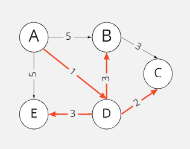 

> Desde el Vertice "A" : {A,D},{D,C},{D,B},{D,E}

#### Kruskal 
 
> Desde el Vertice "A" : {A,D},{D,C},{D,B},{D,E}
> Para este caso son similares

#### BFS Algorithim
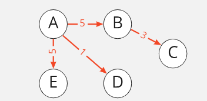
> Desde el Vertice "A"

#### DFS Algorithim
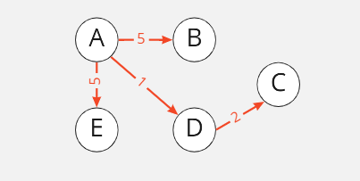
> Desde el Vertice "A"

#### Dijkstra
| Vertice  | Camino    | Peso total | 
|----------|-----------|------------|
| D        |  A->D     |      1     | 
| C        |  A->D->C  |      3     | 
| B        |  A->D->B  |      4     | 
| E        |  A->D->E  |      4     |  
  
#### Ejemplo # 1.2 Directed  map (strongly connected)

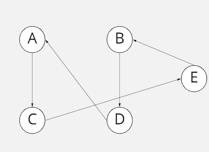

#### Borrar un vertice

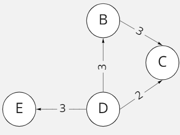

## Ejemplo # 2 Undirected map

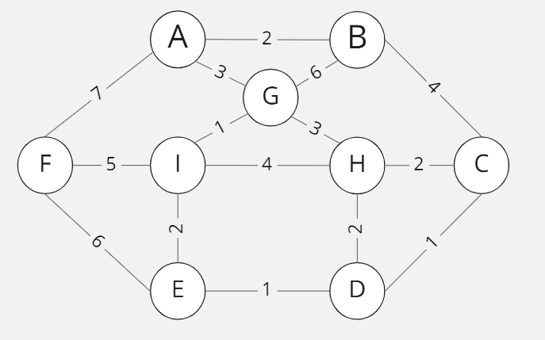

* Operator(A,B) =  2
* Density = 0.416667
* Is it dense ?(threshold = 0.5) =  false
* connected = true;
### Algoritmos

#### Prim
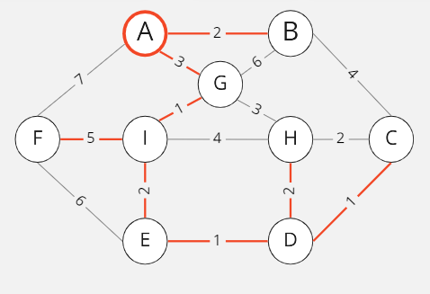
> From vertex A: {A,B} {A,G} {G,I} {I,E} {E,D} {D,C} {D,H} {I,F} 

#### Kruskal
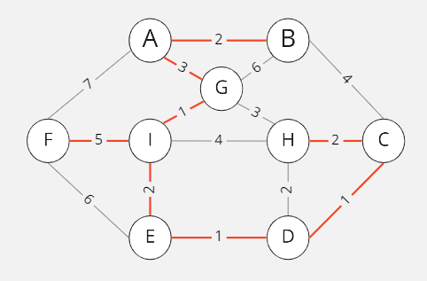
> {C,D} {D,E} {G,I} {A,B} {C,H} {E,I} {A,G} {F,I}

#### BFS algorithim
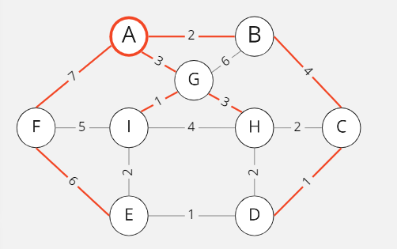
> From Vertex A

#### DFS algorithim
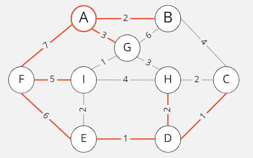
> From Vertex A

#### Dijkstra
| Vertice  | Camino      | Peso total | 
|----------|-------------|------------|
| H        |  A->G->H    |      6     | 
| F        |  A->F       |      7     | 
| G        |  A->G       |      3     | 
| E        | A->G->I->E  |      6     | 
| I        |  A->G->I    |      4     | 
| D        |A->G->I->E->D|      7     | 
| C        |  A->B->C    |      6     | 
| B        |  A->B-      |      2     |  

#### Deleting a vertex

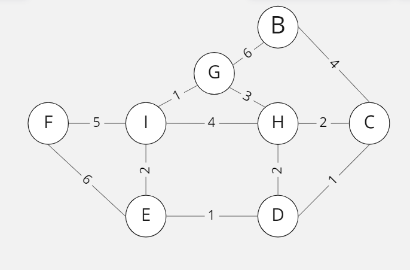
> Deleting vertex A