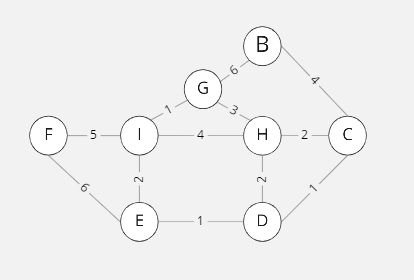

[](https://classroom.github.com/online_ide?assignment_repo_id=6951594&assignment_repo_type=AssignmentRepo)
# Algoritmos y Estructura de Datos
## Proyecto sobre Grafos
--------

## Integrantes

- Ricardo Carbajal Mezarina
- Diego Galvan Rodríguez
- Frings Douglas Barrueta Aspajo

El proyecto del curso consiste en implementar una estructura de datos de grafo y un file parser. La estructura debe soportar los métodos y algoritmos descritos a continuacion:  


## Graph data structure

* El grafo debe ser dinámico (inserciones. eliminaciones, búsquedas, ...)
* Se debe implementar los dos tipos de grafos: dirigidos y no-dirigidos.
* No considerar loops ni multi-arista.


### Methods:
```cpp
bool insertVertex(string id, V data); // Creates a new vertex in the graph with some data and an ID

bool createEdge(string start, string end, E data); // Creates a new edge in the graph with some data

bool deleteVertex(string id); // Deletes a vertex in the graph

bool deleteEdge(string start, string end); // Deletes an edge in the graph, it is not possible to search by the edge value, since it can be repeated

E &operator()(string start, string end); // Gets the value of the edge from the start and end vertexes

float density() const; // Calculates the density of the graph

bool isDense(float threshold = 0.5) const; // Calculates the density of the graph, and determine if it is dense dependening on a threshold value

bool isConnected(); // Detect if the graph is connected

bool isStronglyConnected() throw(); // Detect if the graph is strongly connected (only for directed graphs)

bool empty(); // If the graph is empty

void clear(); // Clears the graph
```

### Algorithms:
```cpp
//Given the graph
UndirectedGraph<char, int> graph;

//1- Generates a MST graph using the Kruskal approach (only for undirected graphs)
Kruskal<char, int> kruskal(&graph);
UndirectedGraph<char, int> result = kruskal.apply(); //return a tree

//2- Generates a MST graph using the Prim approach (only for undirected graphs)
Prim<char, int> prim(&graph, "A");
UndirectedGraph<char, int> result = prim.apply();//return a tree

//3- A *
AStar<char, int> astar(&graph, "A", "Z", vector<int> heuristics);
UndirectedGraph<char, int> result = astar.apply();

```


## JSON file parser
* Construye un grafo a partir de una archivo JSON de aereopuertos del mundo.


### Methods:
```cpp
void clear(); // Clears parser saved atributes

void readJSON(); // Parses JSON file and saves data into class
// NOTE: each derived class has its own readJSON method

void uGraphMake(UndirectedGraph<string, double> &tempGraph); // Adds the parsed data into the specified undirected graph

void dGraphMake(DirectedGraph<string, double> &tempGraph); // Adds the parsed data into the specified directed graph
```

## [Git Karma Guidelines](http://karma-runner.github.io/5.2/dev/git-commit-msg.html)

```
<type>(<scope>): <subject>

<body>
```

### Allowed ```<type>``` values

* feat (new feature for the user, not a new feature for build script)
* fix (bug fix for the user, not a fix to a build script)
* docs (changes to the documentation)
* style (formatting, missing semi colons, etc)
* refactor (refactoring production code, eg. renaming a variable)
* test (adding missing tests, refactoring tests)
* chore (updating grunt tasks etc)

### Allowed ```<scope>``` values

* graph
* directedGraph
* undirectedGraph
* parser
* main
* tester

# Ejemplos

## Ejemplo # 1 Directed map

 


* Operador () entre A y B = 5
* Densidad = 0.35
* Strongly Connected = false

### Algoritmos
#### Prim
 

> Desde el Vertice "A" : {A,D},{D,C},{D,B},{D,E}

#### Kruskal 
 
> Desde el Vertice "A" : {A,D},{D,C},{D,B},{D,E}
> Para este caso son similares

#### BFS Algorithim

> Desde el Vertice "A"

#### DFS Algorithim

> Desde el Vertice "A"

#### Dijkstra
| Vertice  | Camino    | Peso total | 
|----------|-----------|------------|
| D        |  A->D     |      1     | 
| C        |  A->D->C  |      3     | 
| B        |  A->D->B  |      4     | 
| E        |  A->D->E  |      4     |  
  
#### Ejemplo # 1.2 Directed  map (strongly connected)


#### Borrar un vertice



## Ejemplo # 2 Undirected map


* Operator(A,B) =  2
* Density = 0.416667
* Is it dense ?(threshold = 0.5) =  false
* connected = true;
### Algoritmos

#### Prim

> From vertex A: {A,B} {A,G} {G,I} {I,E} {E,D} {D,C} {D,H} {I,F} 

#### Kruskal

> {C,D} {D,E} {G,I} {A,B} {C,H} {E,I} {A,G} {F,I}

#### BFS algorithim

> From Vertex A

#### DFS algorithim

> From Vertex A

#### Dijkstra
| Vertice  | Camino      | Peso total | 
|----------|-------------|------------|
| H        |  A->G->H    |      6     | 
| F        |  A->F       |      7     | 
| G        |  A->G       |      3     | 
| E        | A->G->I->E  |      6     | 
| I        |  A->G->I    |      4     | 
| D        |A->G->I->E->D|      7     | 
| C        |  A->B->C    |      6     | 
| B        |  A->B-      |      2     |  

#### Deleting a vertex

