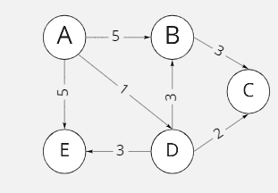

[](https://classroom.github.com/online_ide?assignment_repo_id=6951594&assignment_repo_type=AssignmentRepo)
# Algoritmos y Estructura de Datos
## Proyecto sobre Grafos
--------

## Integrantes

- Ricardo Carbajal Mezarina
- Diego Galvan Rodríguez
- Frings Douglas Barrueta Aspajo

El proyecto del curso consiste en implementar una estructura de datos de grafo y un file parser. La estructura debe soportar los métodos y algoritmos descritos a continuacion:  


## Graph data structure

* El grafo debe ser dinámico (inserciones. eliminaciones, búsquedas, ...)
* Se debe implementar los dos tipos de grafos: dirigidos y no-dirigidos.
* No considerar loops ni multi-arista.


### Methods:
```cpp
bool insertVertex(string id, TV data); // Creates a new vertex in the graph with some data and an ID
```

* Descripcion: Funcion elemental que permite insertar un vertice con un identificador y la data que guarda, esta funcion revisa si es que el id es repetido o no

* Parameters:
  - string id: Identificador del vertice, este es unico
  - TV data: Contenido del vertice, el tipo del dato se define cuando se crea el grafo

* Return:
  - bool: Return un true si se pudo insertar correctamente el vertice y un false si no

* Consideraciones: Ninguna


```cpp
bool createEdge(string start, string end, TE data); // Creates a new edge in the graph with some data
```

* Descripcion: Funcion elemental que permite insertar una arista con un peso especifico entre dos vertices que pueden ser identificados atraves de su id.

* Parameters:
  - string start: Identificador del vertice inicial
  - string end: Identificador del vertice final
  - TE data: Peso de la arista, el tipo del peso se define cuando se crea el grafo

* Return:
  - bool: Return un true si se pudo insertar la arista correctamente y un false si no

* Consideraciones: Para grafos no dirigidos, no importa el orden de los vertices ingresados, mientras que en grafos dirigidos la arista iniciara en el vertice con id start y apuntara el vertice con id end.

```cpp
bool deleteVertex(string id); // Deletes a vertex in the graph
```

* Descripcion: Funcion elemental que permite eliminar un vertice con el identificador de este, esta funcion elimina todas las aristas que este vertice tiene en su lista.

* Parameters:
  - string id: Identificador del vertice

* Return:
  - bool: Return un true si se pudo eliminar correctamente el vertice y un false si no

* Consideraciones: Para grafos no dirigidos, tambien se eliminaran aristas en las listas de otras vertices, mientras que en grafos dirigidos solo se eliminaran las aristas que salgan del vertice a eliminar y que solo se encuentran en su lista de aristas.

```cpp
bool deleteEdge(string start, string end); // Deletes an edge in the graph, it is not possible to search by the edge value, since it can be repeated
```

* Descripcion: Funcion elemental que permite eliminar una arista entre dos vertices directamente conectados y que pueden indentificarse con los ids que se van a ingresar

* Parameters:
  - string start: Identificador del vertice inicial
  - string end: Identificador del vertice final

* Return:
  - bool: Return un true si se pudo eliminar correctamente la arista y un false si no

* Consideraciones: Para grafos no dirigidos, no importa el orden en que se ingresen los ids de los vertices, pues se va a eliminar la misma arista en ambas lista de aristas en los dos vertices. Para grafos dirgidos, solo se buscara la arista en la lista de aristas del vertice con id start y se eliminara la arista que apunta al vertice con id end.

```cpp
TE &operator()(string start, string end); // Gets the value of the edge from the start and end vertexes
```

* Descripcion: Funcion que retorna el 

* Parameters:
  - string id: Identificador del vertice, este es unico
  - TV data: Contenido del vertice, el tipo del dato se define cuando se crea el grafo

* Return:
  - bool: Return un true si se pudo insertar correctamente el vertice y un false si no

* Consideraciones: Ninguna

```cpp
float density() const; // Calculates the density of the graph
```

* Descripcion: Funcion elemental que permite insertar un vertice en con el identificador y la data que guarda, esta funcion revisa si es que el id es repetido o no

* Parameters:
  - string id: Identificador del vertice, este es unico
  - TV data: Contenido del vertice, el tipo del dato se define cuando se crea el grafo

* Return:
  - bool: Return un true si se pudo insertar correctamente el vertice y un false si no

* Consideraciones: Ninguna

```cpp
bool isDense(float threshold = 0.5) const; // Calculates the density of the graph, and determine if it is dense dependening on a threshold value
```

* Descripcion: Funcion elemental que permite insertar un vertice en con el identificador y la data que guarda, esta funcion revisa si es que el id es repetido o no

* Parameters:
  - string id: Identificador del vertice, este es unico
  - TV data: Contenido del vertice, el tipo del dato se define cuando se crea el grafo

* Return:
  - bool: Return un true si se pudo insertar correctamente el vertice y un false si no

* Consideraciones: Ninguna

```cpp
bool isConnected(); // Detect if the graph is connected
```

* Descripcion: Funcion elemental que permite insertar un vertice en con el identificador y la data que guarda, esta funcion revisa si es que el id es repetido o no

* Parameters:
  - string id: Identificador del vertice, este es unico
  - TV data: Contenido del vertice, el tipo del dato se define cuando se crea el grafo

* Return:
  - bool: Return un true si se pudo insertar correctamente el vertice y un false si no

* Consideraciones: Ninguna

```cpp
bool isStronglyConnected() throw(); // Detect if the graph is strongly connected (only for directed graphs)
```

* Descripcion: Funcion elemental que permite insertar un vertice en con el identificador y la data que guarda, esta funcion revisa si es que el id es repetido o no

* Parameters:
  - string id: Identificador del vertice, este es unico
  - TV data: Contenido del vertice, el tipo del dato se define cuando se crea el grafo

* Return:
  - bool: Return un true si se pudo insertar correctamente el vertice y un false si no

* Consideraciones: Ninguna

```cpp
bool empty(); // If the graph is empty
```

* Descripcion: Funcion elemental que permite insertar un vertice en con el identificador y la data que guarda, esta funcion revisa si es que el id es repetido o no

* Parameters:
  - string id: Identificador del vertice, este es unico
  - TV data: Contenido del vertice, el tipo del dato se define cuando se crea el grafo

* Return:
  - bool: Return un true si se pudo insertar correctamente el vertice y un false si no

* Consideraciones: Ninguna

```cpp
void clear(); // Clears the graph
```
* Descripcion: Funcion elemental que permite insertar un vertice en con el identificador y la data que guarda, esta funcion revisa si es que el id es repetido o no

* Parameters:
  - string id: Identificador del vertice, este es unico
  - TV data: Contenido del vertice, el tipo del dato se define cuando se crea el grafo

* Return:
  - bool: Return un true si se pudo insertar correctamente el vertice y un false si no

* Consideraciones: Ninguna


### Algorithms:
```cpp
//Given the graph
UndirectedGraph<char, int> graph;

//1- Generates a MST graph using the Kruskal approach (only for undirected graphs)
Kruskal<char, int> kruskal(&graph);
UndirectedGraph<char, int> result = kruskal.apply(); //return a tree

//2- Generates a MST graph using the Prim approach (only for undirected graphs)
Prim<char, int> prim(&graph, "A");
UndirectedGraph<char, int> result = prim.apply();//return a tree

//3- A *
AStar<char, int> astar(&graph, "A", "Z", vector<int> heuristics);
UndirectedGraph<char, int> result = astar.apply();

```


## JSON file parser
* Construye un grafo a partir de una archivo JSON de aereopuertos del mundo.


### Methods:
```cpp
void clear(); // Clears parser saved atributes

void readJSON(); // Parses JSON file and saves data into class
// NOTE: each derived class has its own readJSON method

void uGraphMake(UndirectedGraph<string, double> &tempGraph); // Adds the parsed data into the specified undirected graph

void dGraphMake(DirectedGraph<string, double> &tempGraph); // Adds the parsed data into the specified directed graph
```

## [Git Karma Guidelines](http://karma-runner.github.io/5.2/dev/git-commit-msg.html)

```
<type>(<scope>): <subject>

<body>
```

### Allowed ```<type>``` values

* feat (new feature for the user, not a new feature for build script)
* fix (bug fix for the user, not a fix to a build script)
* docs (changes to the documentation)
* style (formatting, missing semi colons, etc)
* refactor (refactoring production code, eg. renaming a variable)
* test (adding missing tests, refactoring tests)
* chore (updating grunt tasks etc)

### Allowed ```<scope>``` values

* graph
* directedGraph
* undirectedGraph
* parser
* main
* tester

# Ejemplos

## Ejemplo # 1 Directed map




## Ejemplo # 1.2 Directed  map (strongly connected)

## Ejemplo # 2 Undirected map
